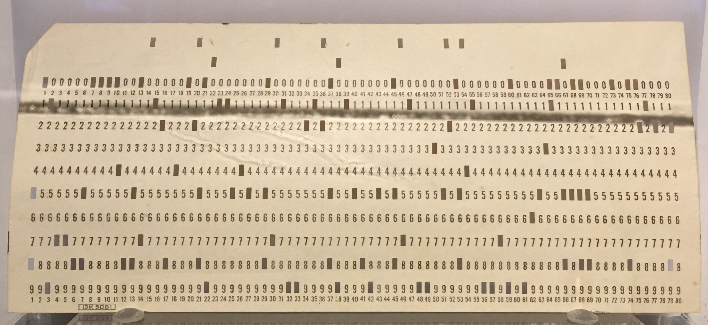

# Fastcampus 
## Frontend Dev SCHOOL
### Intro to Computer Science

---
<!--
page_number: true
$size: A4
footer : fastcampus 프론트엔드 개발 스쿨, Wooyoung Choi, 2018
-->
## Introduce
### 최우영

- Solution Architect, Web Developer, Instructor
- Skills: Python, Golang, Julia, Node.js, Google tag manager ...

#### blog: https://blog.ulgoon.com/
#### github: https://github.com/ulgoon/
#### email: me@ulgoon.com

---
## 수업을 본격적으로 시작하기 전

---
## Goal
- 컴퓨터를 이해하고, 메모리 구조체계에 대해 이해할 수 있다.
- Computational Thinkinig을 이해하고 실생활에 적용할 수 있다.
- 프로그래밍에 대한 전반적인 이해를 할 수 있다.

---
## understanding of computer systems

---
## What is Computer?

---
## What is Computer?
`Compute` + `er`

---
### Computation vs Calculation

`"calculation"` implies a strictly arithmetic process, 
whereas `"computation"` might involve applying rules in a systematic way

---
### Computer vs Calculator

- `Stored Program` computer -> Computer
	- Stores and Executes intructions
- `Fixed Program` computer -> Calculator
	- just calculate

엇? 그럼 공학용 계산기는???

---
### Computer Science and Engineering
- 컴퓨터의 소프트웨어를 다루는 학문
- 컴퓨터라는 물리적 기기를 연구하는 것이 아닌 `Compute`r 의 개념과 구조를 이해하고 구현하는 학문

---
### Computer

---
### Basic Computer Architecture

---
### Basic Computer Architecture
- Program Counter - contains the address (location) of the instruction being executed at the current time
- ALU(Arithmetic Logic) - `+, -, *, /, AND, OR, NOT, `

---
### CPU and MicroProcessor

---

---
### Architecture Naming
- x86

8080 - 8bit

8086 - 16bit

8088 - 8bit
80286 - 16bit

80386 - 32bit
..

---
### Architecture Naming

- IA64

Itanium - IA64 based 64bit, 1999
...

- AMD64

Opteron - x86-64based 64bit, 2003
Athlon
AMD Phenom
AMD FX
Ryzen
..

- ~~Intel64~~ == AMD64

Xeon - x86-64 based 64bit, 2004
Core 2
Core i Series
..

---
### Block Diagram of 8086

---
### Memory Segments of 8086

---
### CISC&RISC Architecture
- Complex Instruction Set Computers
	- 복잡한 명령구조
	- 어드레싱에 강점
	- 전력 신경쓸 필요없이 고성능 컴퓨팅에 사용
	- Intel x86, AMD64, .. 
- Reduced Instruction Set Computers
	- 명령어의 단순화
	- 메모리 접근 횟수가 적음
	- 저전력 프로세싱에 사용
	- SPARC, ARM, ..

---
### Memory

---
### Memory
- 컴퓨터에서 사용할 수 있도록 정보를 저장하는 공간

---
- Random Access Memory
	- 자유롭게 읽고 쓸 수 있는 주기억장치
	- 메모리의 주소로 그 위치에 접근
	- RAM의 어떤 위치로든 같은 시간에 접근(Random Access)
	- 컴퓨터가 느려지면 재부팅을 하세요!

---
- Read Only Memory
	- 전원이 공급되지 않아도 그 정보를 유지하는 주기억장치
	- 비싸거나 느려서 안정적인 정보를 저장해야 할 때 사용
	- BIOS, OS, Firmware 정보 저장에 쓰임

---
### OS
- Operating System: 운영체제
- 시스템 하드웨어와 응용 소프트웨어(한글, excel, ..)의 리소스를 관리하는 시스템 소프트웨어

---
### Type
- Single-tasking / Multi-tasking
	- 한번에 1개 / n개 의 프로그램을 동시 수행(achieved by time-sharing)
- Single-user / Multi-user
- Distributed

Hardware <--> `Operating System` <--> Application Software <--> User

---
### Chronicles of OS

#### Unix
- Starting in the 1970s by AT&T
- Ken Thompson, Denis Ritchie, ..

#### Unix-like
- Solaris
- BSD
- MacOS

---
#### Linux
- Unix-clone OS 
- GNU/Linux
- Sep 17 1991 by Linus Torvalds

`GNU is not Unix`

- Ubuntu
- Fedora
- CentOS
- Debian
- Linux Mint
- ..

---
#### Linux-like
- Android
- Tizen
- Chrome OS
- ..

---
#### Windows
- CP/M-DOS -> MS-DOS
- Windows 1
- ..
- Windows 10
- Windows 95
- Windows 98
- Windows 2000

---
#### Windows 9x vs Windows NT
MS-DOS based -> 16bit
WindowsNT Kernel(3.1) based -> 32bit
WindowsNT Kernel(6.1) based -> x86-64(AMD64)

---
### Patch & Debug

---

---

---
### Computational Thinking
> 정답이 정해지지 않은 문제에 대한 해답을 일반화하는 과정

---
### Process of Computational Thinking
1) 문제 조직화(추상화) - Problem Formulation (abstraction)
2) 솔루션 구현(자동화) - Solution Expression (automation)
3) 솔루션 실행 및 평가(분석) - Solution Execution & Evaluation (analyses)

---
### Characteristics of Computational Thinking
- 문제 분해(decomposition)
- 패턴인지 / 데이터 표현(pattern recognition / data representation)
- 일반화 / 추상화(generalization / abstraction)
- 알고리즘(algorithms)

---
### Computational Thinking Process

- 문제인지
	- `배가 고프다`

---
### Computational Thinking Process

- 문제조직화
	- 문제분해
		- `뭘 먹긴 해야겠다`
			- `집에서 해결함`
				- `냉장고엔 뭐가있지? 밥은 해놨나? 라면이라도 먹을까? ...`
			- `나가서 해결함` 
				- `편의점? 식당? 패스트푸드? 레스토랑??`

---
### Computational Thinking Process

- 패턴인지
	- `아! 배가고프면 어디서 뭔가를 먹음으로써 Hunger가 False가 되는구나` 
- 일반화/추상화
	- 추상화(간결하고 명확하게 단순화, 일반화, 개념화)
		- `배가 고프면`: `{{어디}}`에서 `{{어떻게}}`해결함
	- 알고리즘

---
### Computational Thinking Process

---
### Computational Thinking Process
- 솔루션구현
- 솔루션실행 및 평가
	- `솔루션대로 실행해서 나는 배고픔을 인지하고 해결하게 되었다.`
	- `돈 보유량에 따라 다양한 선택지를 둬야겠다`
	- `집에서 밥이 없으면 굶지말고 밥을 해야겠다.`
